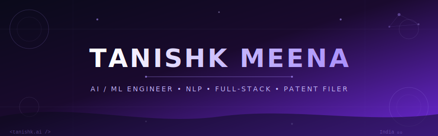

<div align="center">

<!-- HERO BANNER — switches automatically with system theme -->
<picture>
  <source media="(prefers-color-scheme: dark)" srcset="tanishk-header-dark.svg" />
  <source media="(prefers-color-scheme: light)" srcset="tanishk-header-light.svg" />
  
</picture>

<!-- TYPING ANIMATION -->
<picture>
  <source media="(prefers-color-scheme: dark)"
    srcset="https://readme-typing-svg.demolab.com?font=JetBrains+Mono&weight=700&size=20&duration=2800&pause=600&color=A78BFA&center=true&vCenter=true&width=860&lines=%E2%9A%A1+NLP+%7C+Sentiment+Analysis+%7C+Text+Classification;%F0%9F%A4%96+TensorFlow+%7C+PyTorch+%7C+Scikit-learn+%7C+HuggingFace;%F0%9F%94%A5+92%25+Accuracy+NLP+Pipeline+%7C+Patent+Filed;%F0%9F%8C%90+React+%7C+FastAPI+%7C+Full-Stack+AI+Systems;%F0%9F%8F%86+Infosys+Certified+%7C+LPU+Hackathon+Winner" />
  <source media="(prefers-color-scheme: light)"
    srcset="https://readme-typing-svg.demolab.com?font=JetBrains+Mono&weight=700&size=20&duration=2800&pause=600&color=6D28D9&background=FFFFFF00&center=true&vCenter=true&width=860&lines=%E2%9A%A1+NLP+%7C+Sentiment+Analysis+%7C+Text+Classification;%F0%9F%A4%96+TensorFlow+%7C+PyTorch+%7C+Scikit-learn+%7C+HuggingFace;%F0%9F%94%A5+92%25+Accuracy+NLP+Pipeline+%7C+Patent+Filed;%F0%9F%8C%90+React+%7C+FastAPI+%7C+Full-Stack+AI+Systems;%F0%9F%8F%86+Infosys+Certified+%7C+LPU+Hackathon+Winner" />
  
</picture>

<br/><br/>

<!-- SOCIAL BADGES -->
<a href="https://www.linkedin.com/in/tanishk">
  
</a>
<a href="mailto:tanishkmeena659@gmail.com">
  
</a>
<a href="https://github.com/tanishk">
  
</a>

<br/><br/>

<!-- QUICK STATS PILLS -->
<picture>
  <source media="(prefers-color-scheme: dark)" srcset="https://img.shields.io/badge/🎓_B.Tech_CSE-LPU_·_7.84_CGPA-1a0a2e?style=flat-square&labelColor=a78bfa&color=2d1b69" />
  <source media="(prefers-color-scheme: light)" srcset="https://img.shields.io/badge/🎓_B.Tech_CSE-LPU_·_7.84_CGPA-ede9fe?style=flat-square&labelColor=6d28d9&color=ddd6fe" />
  
</picture>
<picture>
  <source media="(prefers-color-scheme: dark)" srcset="https://img.shields.io/badge/🧠_Patent_Filed-Cognitive_Feedback_AI-1a0a2e?style=flat-square&labelColor=FFD700&color=2d1b69" />
  <source media="(prefers-color-scheme: light)" srcset="https://img.shields.io/badge/🧠_Patent_Filed-Cognitive_Feedback_AI-fff8cc?style=flat-square&labelColor=cc9900&color=fff3aa" />
  
</picture>
<picture>
  <source media="(prefers-color-scheme: dark)" srcset="https://img.shields.io/badge/🏅_Infosys-3x_Certified-1a0a2e?style=flat-square&labelColor=00b4d8&color=2d1b69" />
  <source media="(prefers-color-scheme: light)" srcset="https://img.shields.io/badge/🏅_Infosys-3x_Certified-e0f7ff?style=flat-square&labelColor=0077b6&color=cceeff" />
  
</picture>
<picture>
  <source media="(prefers-color-scheme: dark)" srcset="https://img.shields.io/badge/💻_LeetCode-100%2B_Problems-1a0a2e?style=flat-square&labelColor=FFA116&color=2d1b69" />
  <source media="(prefers-color-scheme: light)" srcset="https://img.shields.io/badge/💻_LeetCode-100%2B_Problems-fff3e0?style=flat-square&labelColor=dd7700&color=ffe8c0" />
  
</picture>

<br/>


</div>

---

## 👋 About Me

I'm an AI/ML engineer who loves building intelligent systems that actually ship. From filing a **patent on cognitive feedback intelligence** to achieving **92% classification accuracy** on NLP pipelines — I focus on turning research into production. Currently exploring the intersection of deep learning, full-stack development, and real-world deployment.

```python
class TanishkMeena:
    def __init__(self):
        self.name = "Tanishk Meena"
        self.role = "AI/ML Engineer"
        self.location = "India 🇮🇳"
        self.education = "B.Tech CSE @ LPU (CGPA: 7.84)"
        self.patent = "Cognitive Feedback Intelligence System"

    def current_focus(self):
        return {
            "building": "End-to-end NLP pipelines",
            "learning": "LLMs, Prompt Engineering, RAG",
            "exploring": "Full-stack AI applications"
        }

    def tech_stack(self):
        return ["Python", "Java", "SQL", "TensorFlow", "PyTorch",
                "HuggingFace", "React", "TypeScript", "Flask", "FastAPI"]
```

---

## 🛠️ Tech Stack

**Languages**  


**AI/ML**  


**Web & APIs**  


**Tools & Platforms**  


---

## 🚀 Featured Projects

### 🧠 [Machine Reading of Customer Feedback](https://github.com/tanishk)
**Patent Filed** • *NLTK, Scikit-learn, TF-IDF, Logistic Regression, SVM, Pandas* • `Nov 2025`

End-to-end NLP pipeline that automatically classifies 5,000+ unstructured customer reviews into positive, neutral, and negative categories.

- **Model**: TF-IDF vectorization with Logistic Regression and SVM — SVM outperformed baseline bag-of-words by **11% on F1-score**
- **Accuracy**: Achieved **92% classification accuracy** on unseen data
- **Impact**: Reduced manual feedback review time by an estimated **70%**, enabling data-driven product decisions
- **Patent**: This work formed the foundation for a filed patent on **Cognitive Feedback Intelligence**

<details>
<summary>🔍 Technical Deep Dive</summary>

```python
# Core NLP Pipeline
from sklearn.feature_extraction.text import TfidfVectorizer
from sklearn.svm import SVC
from sklearn.pipeline import Pipeline

pipeline = Pipeline([
    ('tfidf', TfidfVectorizer(ngram_range=(1, 2), max_features=10000)),
    ('clf', SVC(kernel='linear', C=1.0))
])

pipeline.fit(X_train, y_train)
# Accuracy: 92% | F1 improvement over BoW: +11%
```

**Key Highlights:**
- 5,000+ customer reviews processed
- TF-IDF + SVM outperforms baseline by 11% F1
- 70% reduction in manual review time
- Patent filed: Cognitive Feedback Intelligence System

</details>

---

### 📚 [Library Management System](https://github.com/tanishk)
**Production-Ready Full-Stack App** • *React, TypeScript, Vite, Tailwind CSS* • `Jul 2025`

Full-stack library management system handling 500+ books and 200+ members with CRUD, borrowing workflows, and automated fine calculation.

- **Data Structures**: Arrays for O(1) catalogue lookups + custom Linked List for borrowed-book tracking
- **Dashboard**: Live KPI dashboard with borrow rates, overdue counts, and inventory stats — reduced admin overhead by **~60%**
- **Visualisation**: Real-time data structure operation display with time complexity annotations

<details>
<summary>🔍 Architecture Details</summary>

**System Design:**
```
React + TypeScript Frontend
        ↓
   Vite Build Tool
        ↓
 Tailwind CSS UI Layer
        ↓
Custom DSA Layer (Arrays + Linked Lists)
        ↓
  KPI Dashboard + Real-time Viz
```

**Key Features:**
- O(1) catalogue lookups via Array indexing
- Custom Linked List for borrow tracking
- Automated fine calculation engine
- 60% reduction in admin overhead

</details>

---

### 🔒 [Deadlock Detection System with Real-Time Visualization](https://github.com/tanishk)
**Systems + AI Hybrid** • *Python, React, Flask* • `May 2024`

Interactive GUI system that renders Resource Allocation Graphs (RAG) and automatically detects deadlocks using cycle-detection algorithms.

- **Algorithm**: DFS-based cycle detection highlights exact set of deadlocked processes
- **Input**: Dynamic user input for allocation matrices, request matrices, and resource instances
- **Utility**: Real-time visual alerts — useful as a teaching and debugging tool for OS concepts

---

## 🏆 Certifications & Achievements

<table align="center">
<tr>
<td align="center" width="25%">
<br>
<b>Generative AI & LLM</b><br>
<sub>Infosys • Aug 2025</sub>
</td>
<td align="center" width="25%">
<br>
<b>Build Gen AI Apps (No-Code)</b><br>
<sub>Infosys • Aug 2025</sub>
</td>
<td align="center" width="25%">
<br>
<b>Language Principles & Automata</b><br>
<sub>Infosys • Aug 2025</sub>
</td>
<td align="center" width="25%">
<br>
<b>Patent Filed</b><br>
<sub>Cognitive Feedback AI • Nov 2025</sub>
</td>
</tr>
</table>

**Competitive & Extra-Curricular:**
- 💻 **100+ Problems** solved on LeetCode (DSA focused)
- 🧠 **Patent filed** — Cognitive Feedback Intelligence System for Advanced Consumer Insight Extraction
- 🏆 **College Hackathon** participant — AI-focused solutions (Oct 2024)
- 🎓 **7.84 CGPA** — B.Tech Computer Science Engineering, LPU

---

## 📊 GitHub Stats

<div align="center">
  <picture>
    <source media="(prefers-color-scheme: dark)" srcset="https://github-readme-stats.vercel.app/api?username=tanishk&show_icons=true&theme=tokyonight&hide_border=true&bg_color=0d1117&title_color=a78bfa&icon_color=a78bfa&text_color=c9d1d9" />
    <source media="(prefers-color-scheme: light)" srcset="https://github-readme-stats.vercel.app/api?username=tanishk&show_icons=true&theme=default&hide_border=true&bg_color=f5f0ff&title_color=6d28d9&icon_color=7c3aed&text_color=1a1a2e" />
    
  </picture>
  <picture>
    <source media="(prefers-color-scheme: dark)" srcset="https://github-readme-streak-stats.herokuapp.com/?user=tanishk&theme=tokyonight&hide_border=true&background=0d1117&stroke=a78bfa&ring=a78bfa&fire=c4b5fd&currStreakLabel=a78bfa" />
    <source media="(prefers-color-scheme: light)" srcset="https://github-readme-streak-stats.herokuapp.com/?user=tanishk&theme=default&hide_border=true&background=f5f0ff&stroke=7c3aed&ring=6d28d9&fire=4c1d95&currStreakLabel=6d28d9" />
    
  </picture>
</div>

<div align="center">
  <picture>
    <source media="(prefers-color-scheme: dark)" srcset="https://github-readme-stats.vercel.app/api/top-langs/?username=tanishk&layout=compact&theme=tokyonight&hide_border=true&bg_color=0d1117&title_color=a78bfa&text_color=c9d1d9" />
    <source media="(prefers-color-scheme: light)" srcset="https://github-readme-stats.vercel.app/api/top-langs/?username=tanishk&layout=compact&theme=default&hide_border=true&bg_color=f5f0ff&title_color=6d28d9&text_color=1a1a2e" />
    
  </picture>
</div>

---

<div align="center">

## 🤝 Let's Connect

<a href="https://www.linkedin.com/in/tanishk">
  
</a>
<a href="mailto:tanishkmeena659@gmail.com">
  
</a>
<a href="https://github.com/tanishk">
  
</a>

<br><br>

<picture>
  <source media="(prefers-color-scheme: dark)"
    srcset="https://capsule-render.vercel.app/api?type=waving&color=0:0a0a1a,50:1a0a2e,100:6d28d9&height=120&section=footer&text=Building+AI+That+Makes+a+Difference&fontSize=20&fontColor=ffffff" />
  <source media="(prefers-color-scheme: light)"
    srcset="https://capsule-render.vercel.app/api?type=waving&color=0:f5f0ff,50:ede9fe,100:7c3aed&height=120&section=footer&text=Building+AI+That+Makes+a+Difference&fontSize=20&fontColor=1e0050" />
  
</picture>


<br>

**⚡ Open to AI/ML collaborations, research opportunities & internships**

---

<sub>⭐ If you find my work interesting, drop a star on my repositories!</sub>

</div>
